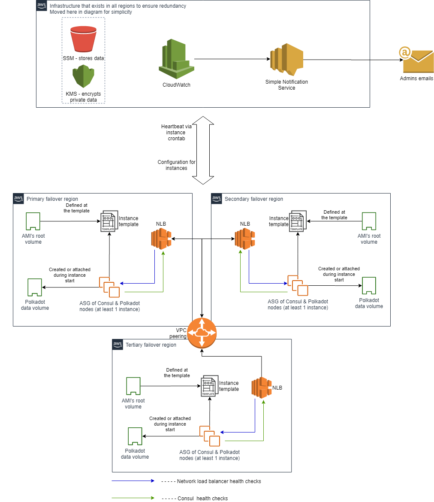

# About project

This repository contains a set of [Terraform](https://www.terraform.io/) scripts that automatically installs a set of minimum 3 [Polkadot](https://polkadot.network/) nodes to the chosen cloud. Currently, scripts support only AWS provider, GCP and Azure scripts are in active development phase.

## Infrastructure idea overview

The overall idea is to create a similar infrastructures in three separate regions - primary, secondary and tertiary. One of the nodes, created at these regions gets elected as a validator. The other two resume operations in archive mode, which allows to switch them to the validator fast once the current validator goes down. This is called "[Warm standby backup](https://tutorialsdojo.com/backup-and-restore-vs-pilot-light-vs-warm-standby-vs-multi-site/)".

The Polkadot node and the Consul server are both installed during instance startup phase. If an instance gets elected as a validator, Consul immediately transforms the regular Polkadot node into a validator. When the lock is lost - the node simply stops. Cloud will notice that the node is down and destroy it replacing it via the autoscaling mechanisms. The new node will be created as a regular one until it gets elected as a validator.

## Leader election mechanism overview

As for the Leader election mechanism the script reuses the existing Leader election solution implemented by [Hashicorp](https://www.hashicorp.com/) team in their [Consul](https://www.consul.io/) solution. The very minimum of 3 nodes is required to start the failover scripts. This requirement comes from the [Raft algorithm](https://www.consul.io/docs/internals/consensus.html) that is used to reach consensus on the current validator. 
The algorithm works by electing one leader accross all nodes joined to the cluster. When one of the instances goes down the rest can still reach consensus via a majority quorum. If the majority quorum is reached (2 out of 3 nodes, 3 out of 5 nodes, etc.), the new validator gets elected. Non-selected nodes continue to operate in non-validator mode. An even number of instances could cause the so-called "split-brain" to occur in case exactly half of the nodes go offline. No leader will be elected at all because no majority quorum can be reached with 2 out of 4 (3 ot out of 6, etc.) instances (51% of votes not reached).

Even if the entire region of a cloud provider goes down, this solution will ensure that the Polkadot node is still up given that two other regions are still up and thus the Consul cluster can reach the quorum majority.

## Project structure overview

This project contains 4 folders.

### [CircleCI](.circleci/)

A folder that contains a CircleCI configuration. CI system verifies incoming PRs using a set of predefined tests.

### [AWS](aws/)

This folder contains Terraform configuration scripts that will deploy the failover solution to AWS Cloud. Use [terraform.tfvars.example](aws/terraform.tfvars.example) file to see the very minimum configuration required to deploy solution. See README inside of AWS folder for more details.

These scripts will deploy the following architecture components:

### [Docker](docker/)

This folder contains the Dockerfile for the Docker image that is published on DockerHub.

### [Tests](tests/)

This folder contains a set of tests to be run through CI mechanism. These tests can be launched manually. Simply go to the tests folder, then select provider to check solution at, open scripts and read the set of environment variables you need to export. Export these variables, install [GoLang](https://golang.org/doc/install) and execute the `go test` command to run the CI tests manually.

# About us

We are Protofire, a blockchain unit at Altoros.
This repository was created to support and automate this project and is a result of the grant issued
by the Web3 Foundation.
In our work we mainly used Terraform to build the automatic IaC solution.

# Contributing

Feel free to contribute by opening issues and PR at this repository. There are no specific contribution rules.

# License

This project is licensed under the GNU General Public License v3.0. See the [LICENSE](LICENSE.md) file for details.
